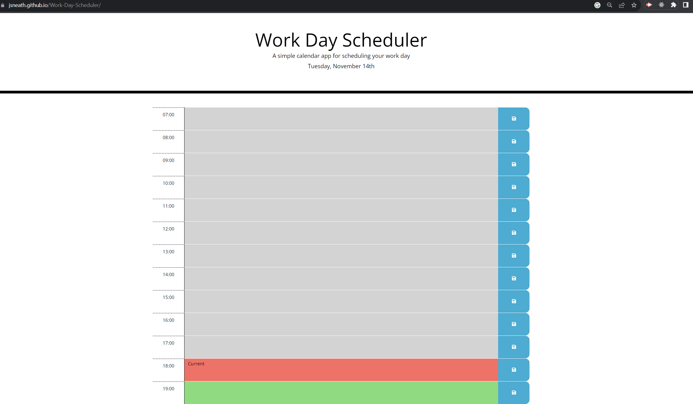

# Work Day Scheduler

Welcome to the Work Day Scheduler project! This practical web application is designed to help users efficiently organize and plan their workday with an easy-to-use interface.

## Features

- **Hourly Time Blocks**: The scheduler displays standard business hours, broken down into hourly blocks.
- **Dynamic Time Awareness**: Each time block changes color based on the current time, indicating past, present, or future hours.
- **Editable Tasks**: Users can click on a time block to enter and edit tasks or appointments.
- **Save Functionality**: A save button next to each time block allows users to securely save their tasks.
- **Local Storage Integration**: Tasks are saved in the browser's local storage, ensuring they persist even when the page is reloaded.
- **Real-Time Clock Update**: The application continuously updates to reflect the current date and time.
- **Responsive Design**: The layout is responsive, making it easy to use on various devices and screen sizes.

## How to Use

1. Open the application in your web browser.
2. Click on a time block corresponding to the desired hour.
3. Enter a task or note in the editable field.
4. Click the save button next to the time block to save the task.
5. Tasks will change color based on the current time, with past hours in grey, the current hour in red, and future hours in green.
6. Saved tasks will remain visible even after refreshing the page.
7. Edit or update tasks as needed throughout the day.

## Technologies Used

- **HTML**: Structures the content and layout of the scheduler.
- **CSS**: Styles the visual elements, including time blocks and buttons.
- **JavaScript**: Implements the application logic, including time-based color coding and local storage handling.
- **Day.js**: A lightweight JavaScript date library for parsing, validating, manipulating, and formatting dates.

## Links

Live URL: https://jsneath.github.io/Work-Day-Scheduler/
Repository: https://github.com/jsneath/Work-Day-Scheduler

